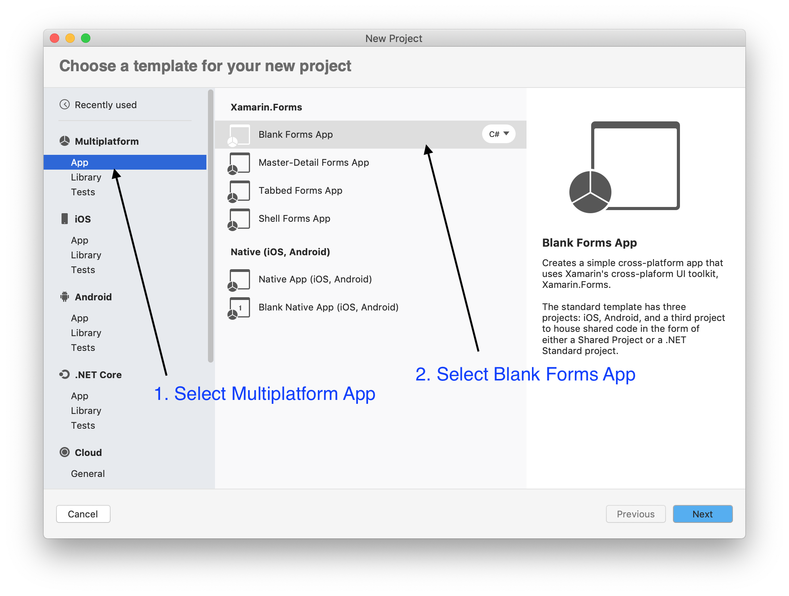
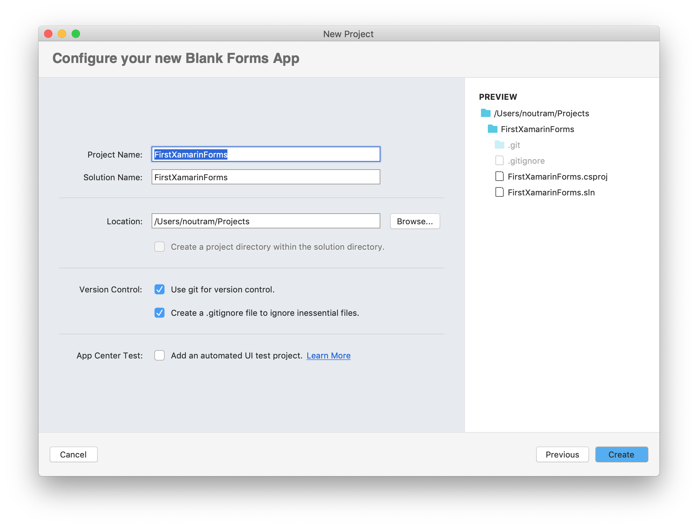

[Table of Contents](README.md)

# Create your First Project (Mac OS)

## Start Visual Studio
When you run Visual Studio 2019 (VS2019) for Mac , you should see the following:

## Choose a Blank Xamarin.Forms App
First choose a blank forms app. Note also there are options for Native iOS and Android apps. For this course, you should ignore these.

## Project a Project Name
On the next page, give your app a name. Also, provide an "Organisational ID". This can be anything for now, but is typically the reverse DNS name of a company website. When you come to submit on the App Stores, this will be important.

## Configure the App
For now, leave this page as it is. You might want to change the location of where your apps are stored. As a tip, if you are using OneDrive or iCloud Drive, you might not want to use a folder in their heirarchy. Solution files tend to have a lot of small files (often with long paths) which change rapidly as you build your application. This may have an impact on network traffic and battery life if using a portable computer. My preference is to have a folder in my home directory called `git`
I also keep all subfolders in git synchronised with GitHub.

In my own case:
I work on a policy that if my Mac was driven over by a truck, I would loose not data. Everything is securely held in the cloud.

- I use GitHub and GitHub Desktop for code 
- I use OneDrive (Business) for everything else.

## Xamarin Forms Solution
One you click create, give VS time to setup. You should now see something similar to the image below:

We will now run this app on the simulators for iOS and Android.

## Test on the iOS Simulator
If you are using a Mac, then running on the iOS simulator is a straightforward process. 

- A pre-requisite for this step is that you have installed and run Xcode at least once.
- Set your start up project to the iOS native App
- (Optional) Build the project (CMD-B) and check for errors
- Run

- Once the simulator appears, you should see an image similar to that below

- Try rotating the simulator (CMD-left cursor)

You might want to explore the Simulator menu. There are more things you can do of course.

- Press the stop button to end the simulation.

## Test on Android

----

[BACK](first-exploration.md)
