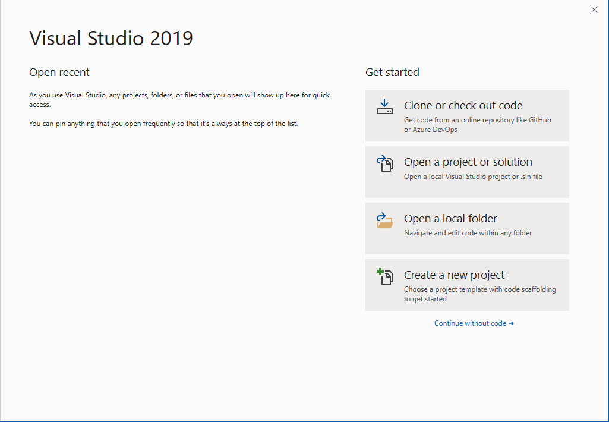
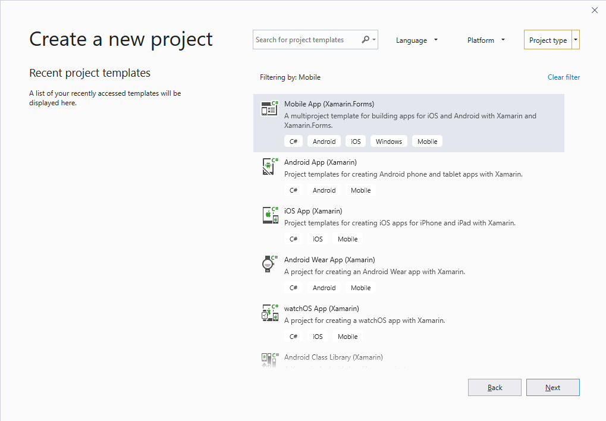
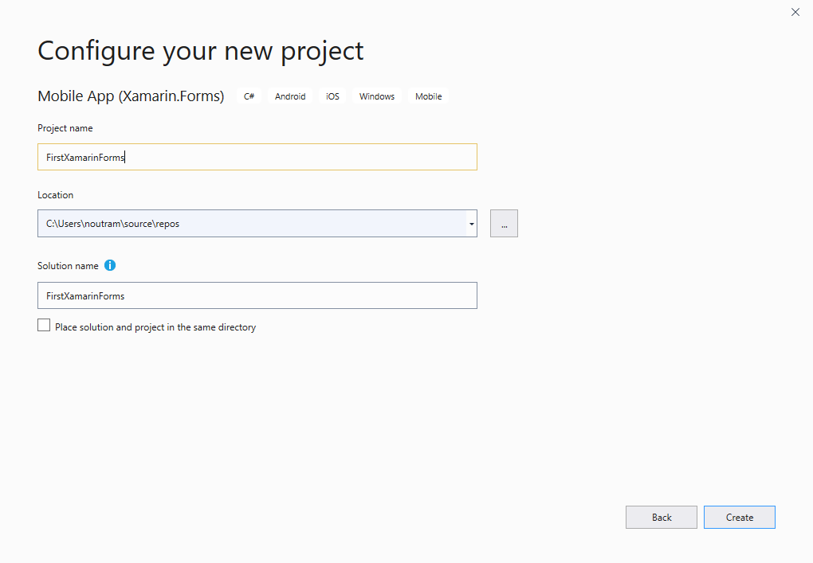

[Table of Contents](README.md)

[BACK](first-exploration.md)

# Create your First Project (Mac OS)

## Start Visual Studio
When you run Visual Studio 2019 (VS2019) for PC , you should see the following:

- Select Create a New Project

## Choose a Mobile App (Xamarin.Forms)
On the resulting screen (see below)

- Under under Project Type choose Mobile. 
- Select "Mobile App (Xamarin.Forms)"
- Click Next

## Choose a Project Name
On the next page, give your app a name and click "Create".

For the location, you might want to change the location of where your apps are stored. As a tip, if you are using OneDrive any other Cloud Drive, you might not want to use a folder in their heirarchy. Solution files tend to have a lot of small files (often with long paths) which change rapidly as you build your application. This may have an impact on network traffic and battery life if using a portable computer. My preference is to have a folder in my home directory called `git`
I also keep all subfolders in git synchronised with GitHub.

In my own case:
I work on a policy that if my Mac was driven over by a truck, I would lose no data that cannot be regenerated. Everything is securely held in the cloud.

- I use GitHub and GitHub Desktop for code 
- I use OneDrive (Business) for everything else.

## Configure the App
In the "new Cross Platform App" dialog, select Blank and then click the OK button.

## Xamarin Forms Solution
One you click create, give VS time to setup. You should now see something similar to the image below:

We will now run this app on the simulators for iOS and Android. 

## Test on the remote iOS Simulator (Optional)
If you are using a PC, then you will need remote access to a Mac to build and running on the iOS simulator.

- A pre-requisite for this step is that you have installed and run Xcode on a Mac at least once. This Mac should be accessible on your network

If you wish to develop for iOS using a PC, [please see the Microsoft support site](https://docs.microsoft.com/xamarin/ios/get-started/installation/windows/connecting-to-mac/)

To build and test on iOS, right click the iOS project and select 

## Testing on Android
Running on the Android Simulator can be performed directly on a PC.

- Make the Android project the Start-Up Project (right click the Android project and choose "Set as StartUp Project)
- On the VS menu, choose Tools->Android->Android Device Manager

- In the window that appears, click "+New"
- Configure the device to use the latest operating system and Create

Visual Studio will now download and create the Android Emulator as specified. This can take a while as the images can be quite large.

Once the device has been created, you can choose an emulator.

Now click the Start button to test. Again, this can take a while especially the first time you do it.

## Resetting the Android Emulator
If you have problems with the Emulator, maybe after an upgrade, try resetting it back to factory settings.

- First close all emulators down
- Back in Visual Studio, choose Tools->Android->Android Device Manager
- Right-click the emulator you wish to reset and choose 'Factory Reset'

# Keeping it all up to date
As a general rule, for this course you can mostly leave things as they are. However, as a working developer you sometimes need to update various components in a Xamarin.Forms solution. These are discussed in turn.

## Updates for Xamarin Forms or other libraries
Updates to Xamarin Forms can occur fairly frequently. These can be feature additions and/or bug fixes. For any given project:

- Right-click the solution 
- Select "manage NuGet packages for Solution"
- In the window that appears, click the Updates tab
- Select all packages you wish to update (probably all of them)
- Click update and agree to each dialogue box that appears

[NuGet](https://www.nuget.org/) is the .NET package manager. At some point you will probably want to explore this more, but that is left for later.

A number of packages might be updated. Commonly 'Xamarin Forms' is updated for the shared and the native projects. It is important all three have the same version of NugGet packages.

## A new version of Android or iOS being released
For Android, this typically means a newer simulator can be added. Sometimes, you will see warnings that your version of Android is too old for the PlayStore. This becomes relevent when you want to publish an app on the Google Play store. 

A simple update is to create an Android Emulator using the latest version of Android. Note that as we are using the Microsoft Emulator, this might not be available on day 1. 

### Updates to Visual Studio
One of the simplest things to check is for updates to Visual Studio. Under the Help menu item of Visual Studio, click "Check for Updates". 

### Updates to the Android SDK
Sometimes the Software Development Kit (SDK) for Android has updates. This might be bug fixes to the compiler or a new SDK version for example.

- In Visual Studio, click Tools->Android->Android SDK Manager

- Click through Platforms and Tools. Check for an UPDATE button appearing.

For more details, [see the Microsoft documentation](https://docs.microsoft.com/xamarin/android/get-started/installation/android-sdk?tabs=windows)

### Update the Android Settings
The version of Android you are using is specified in the native Android project. 

- Right-Click the Android project and choose Properties
- On the left-hand menu, choose Android Manifest

Scrolling down, you will find the following two settings:

- Minimum Android Version
- target Android Version

- *Minimum Android Version* A quick look at the [Google Distribution Dashboard](https://developer.android.com/about/dashboards) and you will see an estimate of the versions on Android being used in any given month. What is sometimes striking is how few devices are running the latest operating system. It is therefore common to write an app that supports older operating system versions. In this example, we are supporting Android API 21 (Android 5)

- *Target Android Version* In general, _this should be set to the latest stable version of Android_ so that all the new APIs are available and known bugs have been squashed. Updating this might also be a requirement of the PlayStore as policy changes.

### Updates to Xcode
This is realtively simple to manage. 

- Run the Apple Mac App Store application on your remote Mac
- Click "Updates". If there is an update to Xcode, click the button to download and install it. 
- You should then run Xcode once before using the simulator in Visual Studio.

----

[BACK](first-exploration.md)
