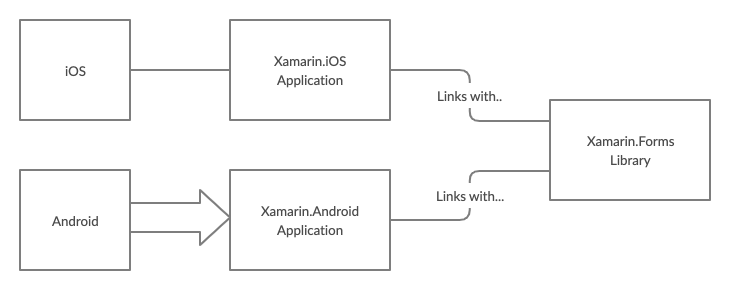
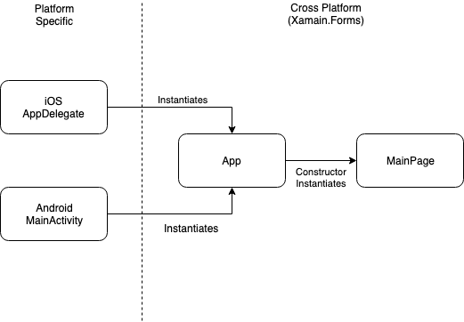

[Table of Contents](README.md)

# First Exploration in Xamarin Forms
This section is intended to familiarise you with the tools and to demonstrate some of the key concepts.
The first task is to create a blank forms app.

- For the Mac, [follow this link](create-project-mac.md)
- For Windows, [follow this link](create-project-pc.md)

For more detailed information on setting up the Android Emulator, [see the  Microsoft page](https://docs.microsoft.com/en-us/xamarin/android/get-started/installation/android-emulator/)

To setup a real device for development, [see the guide from Microsoft](https://docs.microsoft.com/en-us/xamarin/android/get-started/installation/set-up-device-for-development)

Before you try and run anything, take some time to explore these projects. There are some important points to note:

- A Solution is a collection of projects
- A Forms Solution is actually two apps (one for iOS and the other for Android) and one shared library (the Forms project)
- The entry point of each is a Native App - each instantiates Forms code to create the UI etc.
- Each constituent project within the solution has it's own settings, so the Android project has distinct settings to iOS.

Let's now take an initial look at a single page Xamarin.Forms application.

##  (i) Hello World
It is customary to start every course with a Hello World. So much can be captured with such a simple example. Sometimes it is easier to show rather than explain, so we begin with a short video walkthrough.

*TASK*
Recreate what you saw in the video. This is an exercise in familiarisation more than anything, so don't worry if it all seems a bit strange.
   
## (ii) Unpicking what just happened
Ok, let's step back and look at what is happening here. It is suggested that having a high-level view helps to visualise the relationships between all the components, without which, it can all feel strange and out of control.

There is quite a lot of 'detail stuff' in a simple hello world application. 

- partial classes
- XML and XAML
- name spaces
- event handlers
- references to UI elements

