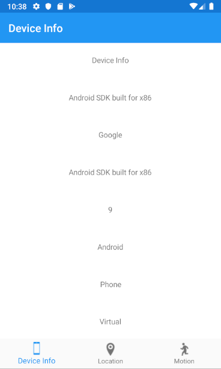
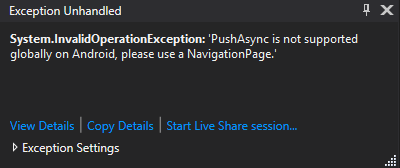

[Back](README.md)

----

## Combining Tabbed Pages and Hierarchial Navigation
It is quite common to combine Tabbed Pages and Navigation Pages. 

* It is important to note that the `TabbedPage` should not be a child of any other container. It is usually set as the `FirstPage` property in the top level application. 
* The TabbedPage is typically the top level container, with children that are of type `ContentPage` and `NavigationPage`.


For this exercise, I am going to walk you though the task. A final solution is also provided.

### Step 1 - Copy the Project Files and Move the Tab Bar
(i) Make a copy of the "TabControllers" folder and rename the new folder to "Combined". 

(ii) Build and run to check it works on the Android simulator.

(iii) Now edit `TopLevelPage.cs` and change the following lines to read as follows:

```C#
    ...
    if (Device.RuntimePlatform == Device.Android)
    {
        //BarBackgroundColor = new Color(1.0, 1.0, 1.0);
        //BarTextColor = new Color(0.0, 0.0, 1.0);

        //Try this instead of the above two lines
        Xamarin.Forms.PlatformConfiguration.AndroidSpecific.TabbedPage.SetToolbarPlacement(this, Xamarin.Forms.PlatformConfiguration.AndroidSpecific.ToolbarPlacement.Bottom);
    }
    ...
```        

(iv) Build and run again on the Android simulator. This time the tab bar should appear at the bottom of the screen (same as iOS).

We are now going to modify the solution in the Combined folder.

### Step 2 - Add a New About Page
(i) Add a folder named 'About' to your Xamarin.Forms project.
(ii) Right click this new folder and add a new Content Page in your project called `AboutPage`. The XAML is shown below.

```XML
<?xml version="1.0" encoding="UTF-8"?>
<ContentPage xmlns="http://xamarin.com/schemas/2014/forms"
             xmlns:x="http://schemas.microsoft.com/winfx/2009/xaml"
             x:Class="PhoneFeatureApp.About.AboutPage"
             Title="About"
             >
    <ContentPage.Content>
        <StackLayout>
            <Label Text="(c) 2020"/>
            <Label Text="Anon"/>
        </StackLayout>
    </ContentPage.Content>
</ContentPage>
```

There is no need to add any code in the code-behind.

We now wish to embed the `DeviceInfoPage` into a Navigation controller.

(iii) Edit `TopLevelPage.cs` again and make the following changes to the beginning of the constructor:

```C#
        public TopLevelPage()
        {
            Title = "Phone Feature App";

            //Manual plumbing
            var info = new DeviceInfoPage();
            var nav = new NavigationPage(info);
            nav.Title = info.Title;
            nav.IconImageSource = info.IconImageSource;
            
            Children.Add(nav);
            Children.Add(new LocationPage());
            Children.Add(new MotionPage());
            ...
```

Run the code again. On the `Device Info` tab, you should see the familiar title bar of a navigation controller at the top of the screen.



### Step 3 - Add a Navigation Button
We want to add a button to the `DeviceInfoPage` to we can navigate in the new page. 

(i) Edit `DeviceInfoPage.xaml` and add the following to the end of the Stack Layout

```XML
<Button Text="About" Command="{Binding AboutButtonCommand}"/>
```

(ii) Build and run to confirm the button appears (no need to click it yet)

(iii) Add the following to the end of `DeviceInfoPageViewModel`

```C#
    private ICommand _buttonCommand;
    public ICommand AboutButtonCommand { get => _buttonCommand; set => _buttonCommand = value; }
```

and the followng at the top:

```C#
    using System.Windows.Input;
```

(iv) Update the constructor of the `DeviceInfoPageViewModel` to hook up the command
```C#
    public DeviceInfoPageViewModel()
    {
        subscribeToBackgroundColChange();
        AboutButtonCommand = new Command(execute: () =>
        {
            _ = Navigation.PushAsync(new About.AboutPage());
        });
    }
```        

(v) Build and run. _Click the About button and the application should crash!_



> Why did it crash? 
>
> The crash occurs on the line `_ = Navigation.PushAsync(new About.AboutPage());`.
>
> If you recall, the `Navigation` property is set by default to `App.Current.MainPage.Navigation` in the base class `ViewModeBase`. This is now a `TabbedPage` and not a `NavigationPage`!

The assumption in the `ViewModelBase` was that all pages are used in hierarchial navigation, with the `MainPage` being a `NavigationPage`. Clearly this needs some work to be of more general purpose use.

### Step 4 - Fixing the Navigation with more "Plumbing and Wiring"
The problem area is with the `DeviceInfoPage` and it's ViewModel hierarchy. Let's first remove the _assumption_ that the application `FirstPage` employs  hierarchial navigation.

(i) Edit `ViewModelBase.cs`

Change the `Navigation` property to 

```C#
    protected INavigation Navigation { get; private set; }
```

By default, this will be `null`. We want the developer to specify this by parameter.

(ii) Add a single constructor to read as follows:

```C#
    public ViewModelBase(INavigation navigation) => Navigation = navigation;
```

This now produces an error in `ViewModelBase<DataModelType>` as it does not have a baseclass constructor to call. We fix that next:

(iii) We need to update `ViewModelBase<DataModelType>`
`ViewModelBase<DataModelType>` (a subclass of `ViewModelBase`) to always call the baseclass constructor. We can _chain_ constructors by adding a single only constructor as follows:

```C#
    public ViewModelBase(INavigation nav) : base(nav) { }
```
There should be no more errors in `ViewModelBase.cs` but there will be a similar one in `ViewModelCommon`

(iv) Do the same as (iii) and fix the error in `ViewModelCommon`

```C#
public ViewModelCommon(INavigation nav) : base(nav) { }
```

We need the fix the (same) error in `DeviceInfoPageViewModel.cs`

(v) Edit `DeviceInfoPageViewModel` and fix the constructor to it reads as follows:

```C#
    public DeviceInfoPageViewModel(INavigation nav) : base(nav)
    {
        subscribeToBackgroundColChange();
        AboutButtonCommand = new Command(execute: () =>
        {
            _ = Navigation?.PushAsync(new About.AboutPage());
        });
    }
```        

Note the `?` after Navigation. We don't want to invoke `PushAsync` if the property is `null`.

(vi) Now the ViewModel hierarchy is updated, we can provide the `DeviceInfoPageViewModel` with a reference to the appropriate Navigation stack.

Edit `DeviceInfoPage.xaml.cs` and pass in a reference as follows:

```C#
    BindingContext = new DeviceInfoPageViewModel(this.Navigation);
```

The ViewModel now has a reference to the `NavigationPage` associated with the DeviceInfoPage.

(v) All the remaining view models need either a reference to a `NavigationPage` or null. You will be getting errors with all the constructors to remind us. For example,

```C#
    public MotionPageViewModel() 
 ```

will produce the error

 > There is no argument given that corresponds to the required formal parameter 'nav' of 'ViewModelCommon.ViewModelCommon(INavigation)'	PhoneFeatureApp ...

To easily fix this for all remaing ViewModels (that do not use hierarchial navigation), modify their constructors as follows:

```C#
    public MotionPageViewModel() : base(null)
```

and 

```C#
    public LocationPageViewModel() : base(null)
```

### Step 5 - Test
You should now have a working appliction that build and runs. If not, open the solution from the GitHub repository. Trying clicking the `About` button - the new page should nagivate on to the screen, with a back button taking you back.

## Reflecting on Navigation
It might be apparent that the _plumbing and wiring_ of navigation in Xamarin.Forms can get a somewhat complex. I would not even claim to have done this particularly well or elegantly.

> If you left this code, and returned to it in a few weels time, would you remember all the relationships between the view controllers, views and navigation pages? What the previous example now needs is extensive documentation to explain the navigation scheme.

If we add another view controller and we get an error simialr to the following, would it be obvious why?

 > There is no argument given that corresponds to the required formal parameter 'nav' of 'ViewModelCommon.ViewModelCommon(INavigation)'	PhoneFeatureApp ...

No doubt someone following this will spot better design patterns to improve on this, but there is a danger of _reinventing the wheel_ if we go too far. Most of the problems centre around instantiatng and initialising objects so that the relationships are set up correctly, loose coupling is maintained etc.. Again it's probably worth stressing that _most people I speak to all use an MVVM framework such as prism, mvvmlight or mvvmcross_ to support complex navigation.

There is now also [Xamarin.Forms Shell](https://docs.microsoft.com/xamarin/xamarin-forms/app-fundamentals/shell/) which I hope to cover in a later section.

----

[Next]()